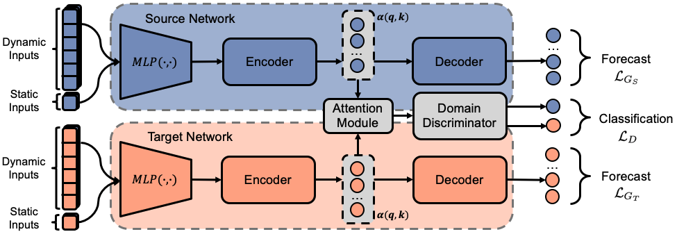

<div align="center">
  
# Attention-based Domain Adaptation Forecasting of Streamflow in Data Sparse Regions

<a href="https://pytorch.org/get-started/locally/"></a>
<a href="https://hydra.cc/"></a>
[](https://arxiv.org/abs/2302.05386)

</div>

<p align="center">
  
</p>

This is the official repository for the ICLR 2023 workshop paper on Climate Change AI titled [Attention-based Domain Adaptation Forecasting of Streamflow in Data Sparse Regions](https://s3.us-east-1.amazonaws.com/climate-change-ai/papers/iclr2023/14/paper.pdf).

## Prerequisites
### Python environment
- Python: 3.8+
- We recommend using Anaconda/Miniconda. With one of the two installed, a dedicated environment with all requirements will be added to the project.

### Hardware Requirements
For improving model training and evaluation, we recommend using a multiple GPU cores. The CPU cores may take a long time too training or lead to an error.

### Installing Neuralhydrology Project
Add repo as a submodule
```
git submodule add https://github.com/neuralhydrology/neuralhydrology.git 
```

Implement own models and datasets in Neuralhydrology
```
cd neuralhydrology
pip install -e .
```

### Download dataset
Download dataset from [Kaggle](https://www.kaggle.com/datasets/rolandoruche/camels). Add downloaded files to root directory as ` data_dir `.


## How to run
The following commands show how to run our proposed model and baselines:

ADAF: 
```
python main.py
```

LSTM-TL:
```
python main.py model=cudalstm
```

GRU-TL:
```
python main.py model=gru
```

## Citing this work
If you would like to cite this work, please use the BibTeX syntax shown below:
```
@inproceedings{oruche2023attentionbased,
  title={Attention-based Domain Adaptation Forecasting of Streamflow in Data-Sparse Regions},
  author={Oruche, Roland R and O'Donncha, Fearghal},
  booktitle={ICLR 2023 Workshop on Tackling Climate Change with Machine Learning},
  url={https://www.climatechange.ai/papers/iclr2023/14},
  year={2023}
}
```

# Acknowledgements
Our work builds upon the source code and data from the following projects:
- [Neuralhydrology](https://github.com/neuralhydrology/neuralhydrology)

We thank all their contributors and maintainers!
## Contact
- Primary contact: Roland Oruche (roruche23@gmail.com)
- Other contacts: Fearghal O'Donncha (feardonn@ie.ibm.com)

